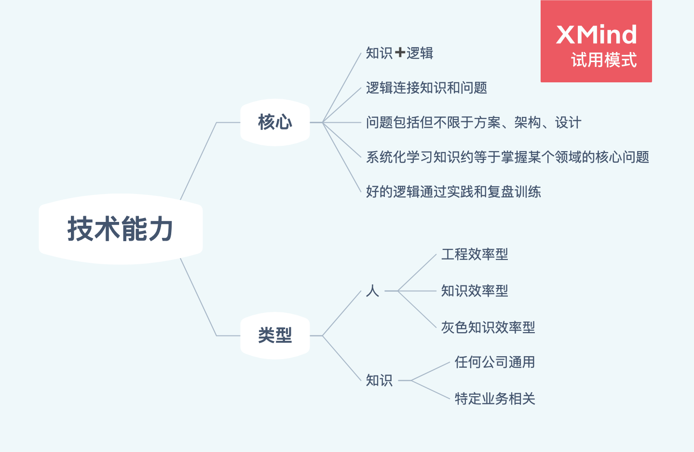
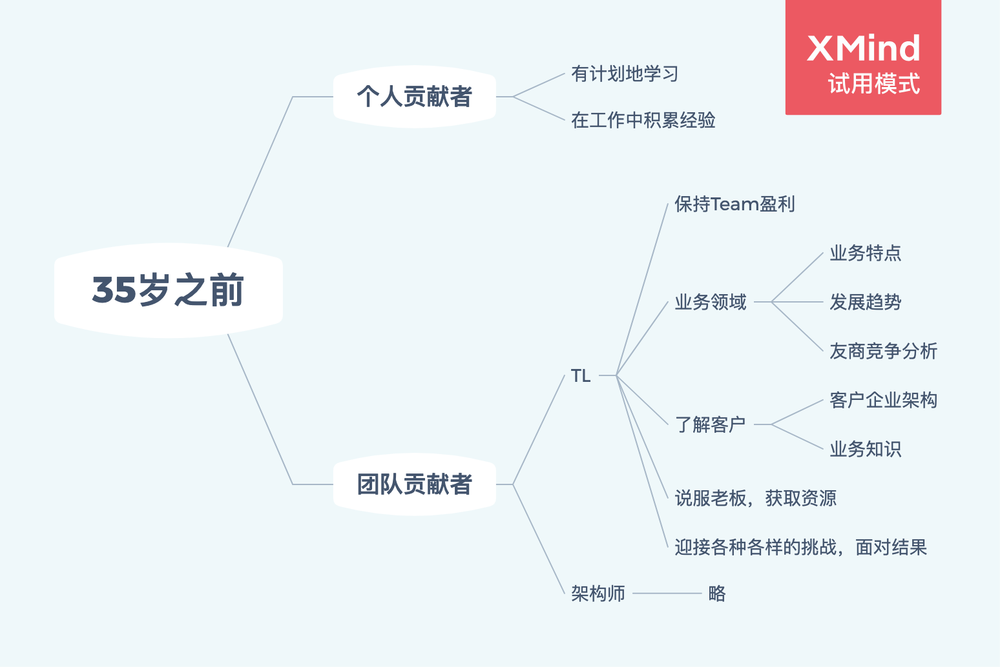
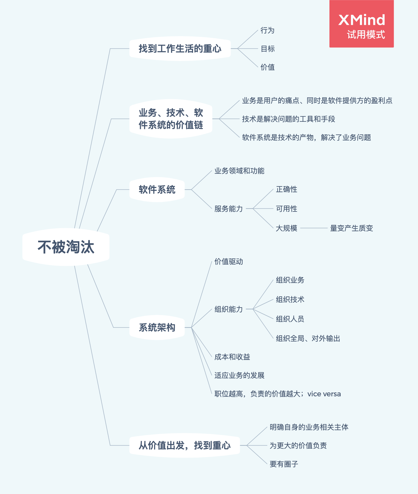
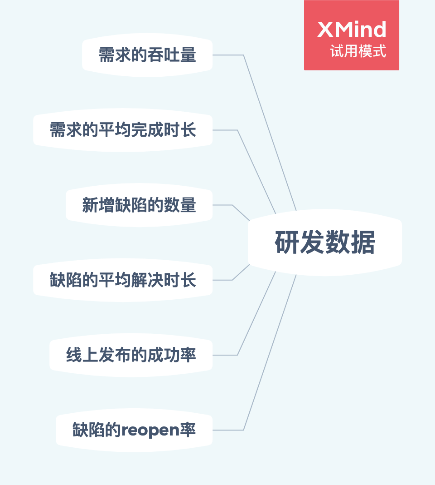
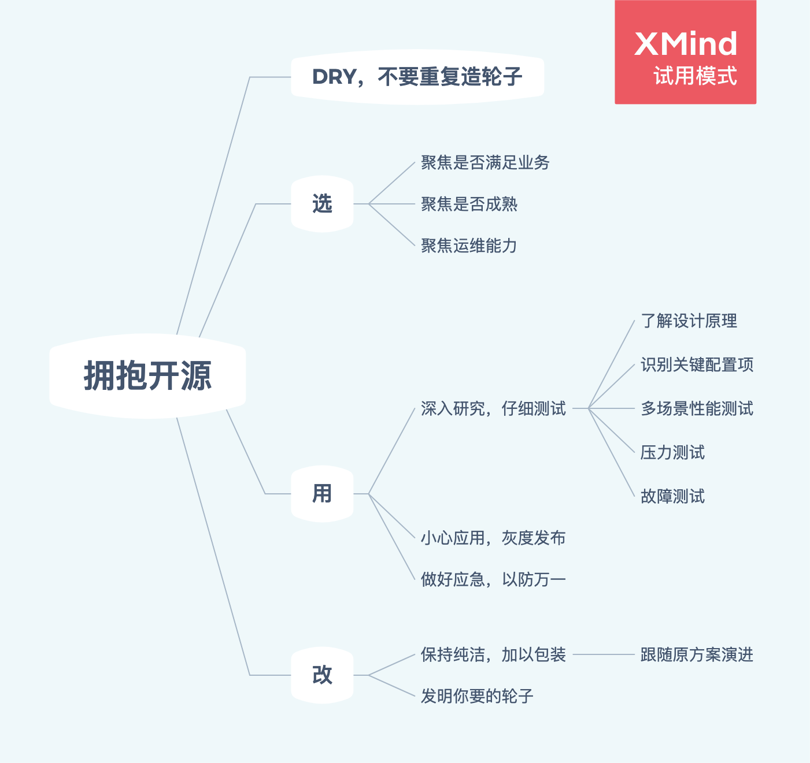
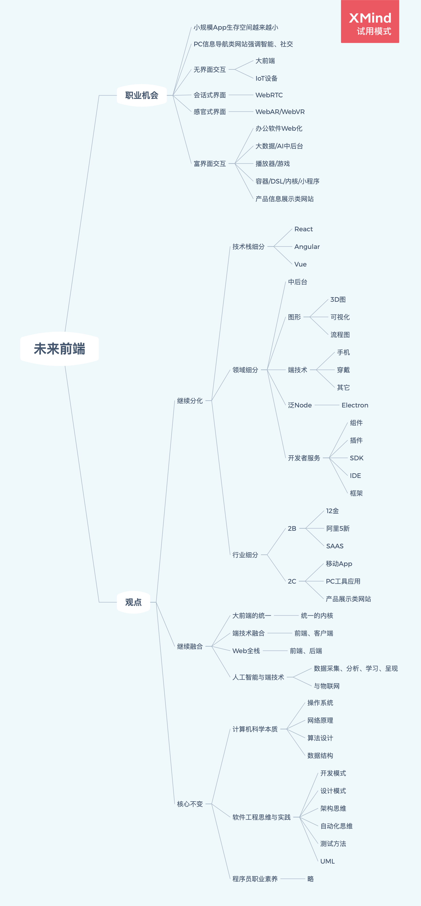
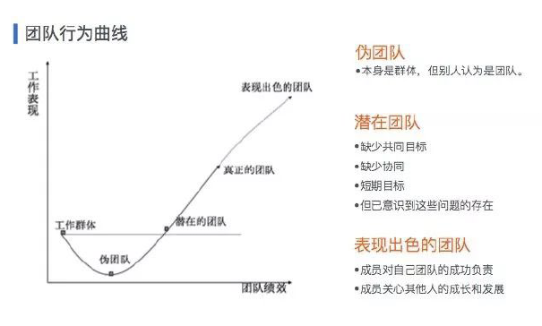
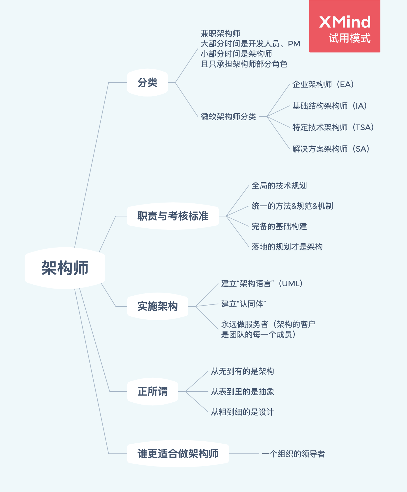

> 前言：这是一篇读《不止代码》后的总结和读后感，有可能是相见恨晚，也有可能即使早些遇到却只能平添压力（因为大学时候没少逃课，😂）。

### 如何快速成长为技术大牛？阿里资深技术专家的总结亮了

#### 感想

感触良多，不过不是所有人都有幸一毕业就加入名企。我有我的道！

### 毕业 3 年，为何技术能力相差越来越大？

#### 感想

暂无感想，不过讲方法论的人总是容易给我自大的印象！

### 程序员吃的是青春饭？本质上取决于……

#### 感想

就是说：毕业后的十年间，前一半作为「个人贡献者」勤奋学习，后一半作为「团队贡献者」继续努力。TL 重点在于保证团队盈利、熟谙客户的业务、管理项目生命周期；架构师重点在于需求分析、合理响应需求的变化、保证团队的技术输出。另外，与下文中呼应，架构师的客户是团队中的每个成员。

### 技术变化那么快，程序员如何做到不被淘汰？

#### 感想

简单地说，一名热爱技术的程序员，成长为一名合格的架构师，就自然不会被淘汰；而拥有优秀的成功的架构案例作为背景，更是能够无上自在地走遍天下。

### 加班越久故障越多，如何跳出程序员的恶性循环？

#### 感想（摘抄）

不要仅用数据去衡量人，数据只是手段，是帮助我们去诊断团队的一个切实有效的手段。学会利用它并驾驭它。因此需要：

- 关注数据，读懂数据。
- 重点问题重点解决，优先解决，一段时间只关注一个或很少的几个问题。
- 相信团队的自驱能力，同时结合 TL 的管理与激励，养成良好的团队建设力。

### 如何在阿里技术面试中脱颖而出？

#### 感想

「STAR」是个平时总结的好方法。以后要注意总结这方面，即使这段时间里没有什么在职的场景。无奈 hhh

### 使用开源项目的正确姿势，血和泪的总结

#### 感想

我曾长期使用一个叫做 `react-vr` 的开源项目，由于其字体解决方案对于汉子来说太不友好，就重写了 `Text` 组件。我当时并没有新建一个组件，而是直接在原组件上做修改，并不好。后来还改动相机相关的代码，这里埋下了隐患，因为这个项目一夜之间改名 `react-360`，很多地方重新封装了。这个技术债务我可能要拖欠一辈子了，因为过了很长一段时间后，二者差异越来越大，又过了段时间，我离开了那家公司。

另外，还是那件事。开源项目最初让人觉得很轻松，那么多事都处理好了。但是随着业务的变化和增加，就不那么称心如意了。这时候，如果有能力，真的需要自己发明自己要的轮子。当然，这是个团队决策，甚至公司决策；切不可一意孤行。

### 前端工程师的未来在哪里？

#### 感想

这部分列举了很多点，感觉是：

- 有点什么新东西就分出一类
- 有点什么好东西就推广开来以致合并
- 大学本科那几门课永垂不朽

如果对这么多的前端分类都有所了解，并且精通其中一二，那简直都不是普通意义上的 T 型人才了。（注：呼应本文前面提到的 T 型人才的话）

### 前端 Leader 如何做好团队规划？阿里内部培训总结公开

#### 感想

TL 还是一种有意思的职业呢。

从团队特征中寻找规划的边界：
| 特征           | 要                         | 不要                           |
| :------------- | :------------------------- | :----------------------------- |
| 背景           | 紧贴业务，关联业务目标优先 | 无业务落地场景                 |
| 团队行为       | 一条线索串起大家的工作     | 各自为战、埋头编码             |
| 人员构成       | 招聘、培养梯队             |                                |
| 业务发展情况   | 体系化思考、降低试错成本   | 单点，盲目                     |
| 业务重点关键字 | 重点思考用户体验           | 向成本妥协                     |
| 资源富裕度     | 招聘、效率                 | 低水平重复劳动，高成本技术方案 |
| TL 汇报对象    | 向上管理、多“科普”         | 靠猜                           |

### 一位优秀前端的自我修养

#### 感想

确实：知识是建立在能力之上的！

### 如何成为一名顶尖的阿里架构师？

#### 感想

就让目标一步步明确吧～

### 哪些技术好书值得一读再读？这有一份经典书单

- 推荐书籍：《Effective Software Testing》
- 推荐书籍：《程序员修炼之道- 从小工到专家》
- 推荐书籍：《设计模式之禅》
- 推荐书籍：《Spoken Language Processing: A Guide to Theory, Algorithm and System Development》
- 推荐书籍：《机器学习导论》
- 推荐书籍：《Reinforcement Learning: An Introduction》
- 推荐书籍：《Programming Rust》
- 推荐书籍：《Machine Learning: A Probabilistic Perspective》
- 推荐书籍：《Architecture of a Database System》

#### 感想

自然语言处理，机器学习 x3，数据库系统架构。爱了！

### 阿里技术大牛最爱的“闲书”，你看过多少？

- 推荐书籍：《从优秀到卓越》
- 推荐书籍：《为什么精英都是时间控》
- 推荐书籍：《创新者的窘境》
- 推荐书籍：《魔鬼经济学》
- 推荐书籍：《孙子兵法》
- 推荐书籍：《创造自然》
- 推荐书籍：《浮生六记》

#### 感想

嗯……我也喜欢佛系的人生～
