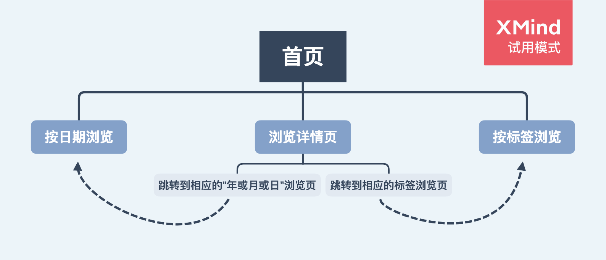

## 前言

> 距离上一次的 V1.0 快两个月了，期间修复了些 bugs，也加了些新功能。文章段落划分基本按照 V1.0 那样，记录以下，生活更美好！

## 配置文件部分


### 变量说明

| 变量名          | 作用                                                                             |
| :-------------- | :------------------------------------------------------------------------------- |
| posts root      | 博客网站定位博文数据库                                                           |
| tpl script path | 提供给博文生成器定位博文网页脚本文件的路径                                       |
| out path        | 提供给博文生成器生成的数据库位置                                                 |
| production      | 提供给博文生成器是否为生产模式，影响生成的 HTML/CSS 文件是否去掉多余的换行和空格 |
| origin          | postMessage 需要                                                                 |
| site root       | 站内跳转需要                                                                     |

### 站点脚本代码切分（提高脚本并行下载数量、降低页面加载时间、提高性能）

```typescript
// webpack 配置
{
  entry: {
    app: 'src/www/app',
  },
  output: {
    filename: '[name].[hash].js',
    chunkFilename: '[name].[hash].js',
  },
  optimization: {
    splitChunks: {
      chunks: 'async',
      minSize: 30000,
      maxSize: 200000,
      minChunks: 1,
      maxAsyncRequests: 10,
      maxInitialRequests: 10,
      automaticNameDelimiter: '~',
    },
  },
  plugins: [
    new HtmlWebpackPlugin({
      template: path.join(process.cwd(), 'src', 'www', 'index.html'),
      filename: './index.html',
      title: '又心真人的博客',
      chunks: ['app'],
    }),
  ],
}

// import() 语句
// app.ts
import('./index');
// index.tsx
import('react-dom').then(({ render }) =>
  render(<App />, document.getElementById('main'))
);
```

```shell
// 优化前
274K  9 30 11:10 app.f629bf8dd3ae91057b3c.js
670B  9 30 11:10 index.html

// 优化后
 21K  9 30 11:15 1.adf85dd9d16e2e91e1e6.js
 45K  9 30 11:15 2.adf85dd9d16e2e91e1e6.js
 21K  9 30 11:15 3.adf85dd9d16e2e91e1e6.js
 11K  9 30 11:15 4.adf85dd9d16e2e91e1e6.js
120K  9 30 11:15 5.adf85dd9d16e2e91e1e6.js
 59K  9 30 11:15 6.adf85dd9d16e2e91e1e6.js
2.8K  9 30 11:15 app~f71cff67.adf85dd9d16e2e91e1e6.js
679B  9 30 11:15 index.html
```

## 启动命令规划部分

最近，发现好多 IDE 都有运行项目里 `npm script` 的功能，而为了避免选择列表太长，所以，并没有抽离公共脚本，做到脚本数量最小。

```javascript
{
  "scripts": {
    "help": "webpack -h",
    "build": "rm -rf build/dev && webpack -p --devtool=false --config=cfg/webpack/gen.dev.js && node ./build/dev/generator.min.js > log.txt",
    "start": "npm run build && concurrently --handle-input 'nodemon --exec \"node ./build/dev/generator.min.js > log.txt\"' 'serve -C -l 5555 ./build/posts/' 'webpack-dev-server -p --devtool=false --config=cfg/webpack/site.dev.js'",
    "public": "rm -rf public build/prod && webpack -p --devtool=false --config=cfg/webpack/site.prod.js && webpack -p --devtool=false --config=cfg/webpack/gen.prod.js && node ./build/prod/generator.min.js > log.txt"
  },
}
```

可以看到，`generator.min.js` 已然区分 `开发模式` 和 `发布模式` ；再也不用担心，由于发布了一下，开发模式就要重启一次了。

## 博文生成器部分

首先，回顾一下大致流程：

1. 创建数据库
2. 识别输入文件夹、准备输出文件夹
3. 读取输入文件夹并区分资源文件（夹）和 markdown 文章文件
4. 拷贝资源文件（夹）到输出目录，并且带上 `template.min.js` 脚本文件
5. 生成 HTML 文件
   - 识别文章 metadata
   - 转化文章内容为 html 文本
   - 替换文章模版数据
6. 记录数据，导出 JSON 格式的数据库文件

### 给 `string` 加过滤器函数

```typescript
// 根目录下 index.d.ts
interface String {
	filter(...fns: (fn(file: string) => boolean)[]): boolean;
}

// xxx.ts文件中
// 实现以上接口
String.prototype.filter = function (
  this: string,
  ...fns: ((file: string) => boolean)[]
): boolean {
  for (let i = 0; i < fns.length; i++) {
    if (fns[i](this)) continue;
    else return false;
  }
  return true;
};

// 调用起来，就可以加入一些语意的感觉
export function isAsset(file: string): boolean {
  return file.filter(notPrivate, isDir);
}

export function isPost(file: string): boolean {
  return file.filter(notPrivate, notDraft, isMarkdown, isFile);
}
```

### preWrite

```typescript
// 采用链式调用和门面模式思想
// pre write: do some cleaning
type WriteFileOptions =
  | string
  | {
      encoding?: string | null | undefined;
      mode?: string | number | undefined;
      flag?: string | undefined;
    }
  | null
  | undefined;

export function preWrite(
  file: string
): {
  writeFileSync: (data: any, options?: WriteFileOptions) => void;
} {
  if (fs.existsSync(file)) fs.removeSync(file);
  fs.createFileSync(file);
  return {
    writeFileSync: (data: any, options?: WriteFileOptions) =>
      fs.writeFileSync(file, data, options),
  };
}

// 链式调用
preWrite(path.join(outDir, CSSMaps[base])).writeFileSync(cssContent);

preWrite(path.join(outDir, name + '.html')).writeFileSync(
  htmlMinify(
    tplContent
      .replace('{{title}}', title)
      .replace('{{hm_baidu}}', hmBaidu())
      .replace('{{javascript}}', tplScriptName)
      .replace('{{stylesheet}}', fetchCSS(stylesheet))
      .replace('{{body_title}}', `${preTitle(fileName)}${title}`)
      .replace(
        '{{body}}',
        `${body}${emailLink(fileName, noReceiveEmails, title)}`
      )
  )
);
```

### 使用 HTML 模版

在上一节的代码片段中可以看到，HTML 模版中使用双大括号语法表示需要替换的变量。这里没有任何变量或者表达式的使用，仅替换为一段字符串。其中有几个特殊的函数，让模版替换过程变得有一点使用变量的意思。

```typescript
// preTitle：开发模式下看到的文章会多一些，包括未完成的草稿和个人隐私文章
export function preTitle(fileName: string): string {
  if (fileName.startsWith('private.')) return '「隐私」';
  if (fileName.startsWith('draft.')) return '「草稿」';
  return '';
}

// hm baidu：在线上模式的时候，页面会嵌入百度数据分析功能
export function hmBaidu(): string {
  return __production__
    ? `
<script>
  var _hmt = _hmt || [];
  (function () {
    var hm = document.createElement('script');
    hm.src = 'https://hm.baidu.com/hm.js?f402a68d651d46513a3688a8d07eb93c';
    var s = document.getElementsByTagName('script')[0];
    s.parentNode.insertBefore(hm, s);
  })();
</script>
  `
    : '';
}

// email link：通过文章metadata可以控制哪些文章末尾可以显示一个发送邮件的链接，默认是显示的；方式虽然古老，但是不用花钱，哈哈哈
export function emailLink(
  fileName: string,
  noReceiveEmails: string,
  title: string
): string {
  if (noReceiveEmails || fileName.startsWith('private.')) return '';

  return `
<br /><br />
<hr />
<br />
<a href="mailto:954382491@qq.com?subject=评价「${title}」">发邮件~来评价~一下吧</a>
<br /><br />
  `;
}
```

### 使用 CSS 模版

CSS 模版中定义了两段 CSS 代码，中间是嵌入 CSS 主题内容的记号（单行注释）。前面一段叫做「全局预设」，后面的一段叫做「全局设定」。所以，可以理解为一篇文章由三段 CSS 按顺序定义（尽量不写!important）。在模版文件中的任意位置，都可以插入其它任何记号。目前在使用的有两个，见下方代码：

```typescript
const CSSMaps: {
  [key: string]: string;
} = {};

export function fetchCSS(base: string): string {
  if (CSSMaps[base]) return CSSMaps[base];

  const baseCSSPath = path.join(
    process.cwd(),
    'src',
    'template',
    'style-source',
    `${base}.css`
  );

  const baseCSSContent = fs.readFileSync(baseCSSPath, {
    encoding: 'UTF-8',
  });

  const cssContent = minify(
    tplCSSContent
      .replace('/* base_stylesheet */', baseCSSContent)
      .replace('/* body_padding_pc */', Sheets[base].padding.pc)
      .replace('/* body_padding_mobile */', Sheets[base].padding.mobile)
  );

  CSSMaps[base] = `${base}.${md5(cssContent).substring(0, 20)}.css`;

  preWrite(path.join(outDir, CSSMaps[base])).writeFileSync(cssContent);

  return CSSMaps[base];
}
```

### minify

```typescript
// 改进了正则表达式
export function minify(content: string): string {
  if (__production__) {
    return content
      .replace(/\/\*[\s\S]*?\*\//g, '')
      .replace(/\n\s*?(\S)/g, ' $1')
      .trim();
  }
  return content;
}
```

期间有个失误，这段代码上线一段时间后，才发现 pre 标签里的内容也被去掉了换行。这是个 bug，随即有了下面的 `htmlMinify`：

```typescript
// 先提取出pre/textarea标签，然后split原内容，最后merge；就像洗扑克牌一样
function extractBlocks(content: string, re: RegExp): string[] {
  const blocks: string[] = [];
  let temp: RegExpExecArray | null;
  while ((temp = re.exec(content))) {
    blocks.push(temp[0]);
  }
  return blocks;
}

function mergeBlocks(content: string, re: RegExp, blocks: string[]): string {
  const otherBlocks: string[] = content.split(re);
  const ret: string[] = [];
  for (let i = 0; i < blocks.length; i++) {
    ret.push(otherBlocks[i], blocks[i]);
  }
  ret.push(otherBlocks[blocks.length]);
  return ret.join('');
}

function htmlBlocksChain(content: string, reS: RegExp[]): string {
  const blocksChain: string[][] = [];
  for (let i = 0; i < reS.length; i++) {
    blocksChain.push(extractBlocks(content, reS[i]));
  }

  let tempRet: string = minify(content);

  for (let i = 0; i < reS.length; i++) {
    tempRet = mergeBlocks(tempRet, reS[i], blocksChain[i]);
  }

  return tempRet;
}

export function htmlMinify(content: string): string {
  if (__production__) {
    return htmlBlocksChain(content, [
      /<pre[\s\S]+?<\/pre>/g,
      /<textarea[\s\S]+?<\/textarea>/g,
    ]).replace(/>\s+</g, '><');
  }
  return content;
}
```

### showdown 插件

围绕图片和下载链接，定义了两个插件。另外，有个关于嵌套列表的设置，也是纠结了一阵子才找到正确配置项的。

```typescript
export const converter = new showdown.Converter({
  extensions: [
    {
      type: 'lang',
      regex: /!\[(.*?)\]\((\S+?) '(.*?)'\)/g,
      replace:
        '<figure><figcaption>$3</figcaption></figure>',
    },
    {
      type: 'lang',
      regex: /!\[(.*?)\]\((\S+?) '(.*?)' =(\S*?)-(\S*?)\)/g,
      replace: (
        _: string,
        $1: string,
        $2: string,
        $3: string,
        $4: string,
        $5: string
      ) =>
        `<figure><figcaption>${$3}</figcaption></figure>`,
    },
    {
      type: 'lang',
      regex: /!\[(.*?)\]\((\S+?) =(\S*?)-(\S*?)\)/g,
      replace: (_: string, $1: string, $2: string, $3: string, $4: string) =>
        `<figure><figcaption>${$1}</figcaption></figure>`,
    },
    {
      type: 'lang',
      regex: /!\[(.*?)\]\((\S+?)\)/g,
      replace:
        '<figure><figcaption>$1</figcaption></figure>',
    },
    {
      type: 'lang',
      regex: /\[(.*?)\]\((\S+?) '(.*?)'\)/g,
      replace: '<a href="$2" download="$3">点击下载「$1」</a>',
    },
    {
      type: 'lang',
      regex: /~~(.+?)~~/g,
      replace: '<s>$1</s>',
    },
  ],
  // metadata: true, // 解析不了yaml数组
  // openLinksInNewWindow: true, // 做下载链接时遇到了bug，所以自己加了一个插件
  disableForced4SpacesIndentedSublists: true,
  parseImgDimensions: true,
  tables: true,
});
```

## 博客网站部分

首先，回顾一下网站地图：



最大的改动就是引入了代码切分技术。其次加了一个鼠标按下音效。

```typescript
import ClickWAV from './click.wav';

const playAudio = () => {
  let player = document.getElementById('click-wav');
  if (!player) {
    player = document.createElement('audio');
    player.setAttribute('src', ClickWAV);
    player.id = 'click-wav';
    document.body.appendChild(player);
  }
  (player as HTMLAudioElement).play();
};

document.body.addEventListener('mousedown', playAudio);
document.body.addEventListener('touchstart', playAudio);

window.addEventListener('beforeunload', () => {
  document.body.removeEventListener('mousedown', playAudio);
  document.body.removeEventListener('touchstart', playAudio);
});
```

## 未来规划部分

由于 Vue 在国内实在太火了，所以打算未来用 Vue3 做一个全新的改版。界面类似 RSS 软件，最左边竖着排列几个好看的图标；接着放二级控制界面；接着是文章视图。总体来说，更适合宽屏显示。

## 同系列文章

- [「里程碑-2020-1.0」博客 V1.0](post:2020-milestone-1-0)
- [回到开头](scroll-to-the-very-top)
