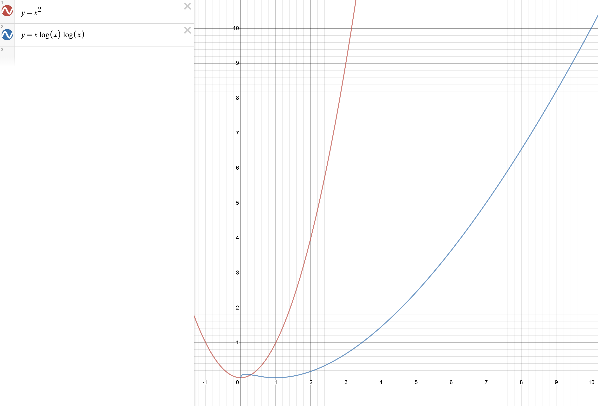

> Dynamic Programming（动态规划）

## 第一个简单的动态规划算法

大学时没上过课，都是闷着自学的；把好多问题都想复杂了，原来用 for 循环迭代填充斐波那契数组就是一个动态规划算法。

### 结合快速求解矩阵幂运算（O(log(n))）计算斐波那契数


重点就在左边矩阵的 n 次幂上！通过递归可以将矩阵乘法的次数降到 log(n) 次（第一章中提供了两种两数相乘的参考算法，均用到递归思想）。实际上，迭代用到的基本运算是加法（O(n)，n 为数字位数），而矩阵运算中使用了更为昂贵的乘法（目前最快的两数字乘法运算的时间复杂度为 O(n log(n)，n 为数字位数)，发现于 2019 年）；所不同的是迭代的循环次数为 n，而计算矩阵的幂的递归次数为 log(n)；所以，这个递归算法比迭代算法快一丢丢，时间复杂度为（Ω(n)，理由是 O(n log(n) log(n)) < O(n^2)，如下图所示）。



那么接下来在设计递归算法之前，还需要若干步推导。从 `figure 1` 看出，我们要设计一个函数，返回值可以是一个元组 `(F(n-1), F(n))`；递归式可以设计为 `T(n) = T(n/2) + O(n)`，这样效率最高。有了目标，`n/2` 是特殊情况，不妨从普通情况开始推导：

首先，这个算法还有一种行向量的表达方式：
!
，另外幂运算的特点是
!
。所以，可以得到 F(n)的计算公式：


有了 `figure 2` 中这个重要公式后，我们分别假设 `n=2t-1,m=t-1` 和 `n=2t,m=t`，得到：


好了，公式部分到此为止，接下来就是代码实现：

```python
# F(n-1), F(n)
def FastRecFibo(n):
    if n == 0:
        return 1, 0
    if n == 1:
        return 0, 1

    m = math.floor(n / 2)
    hprv, hcur = FastRecFibo(m)         # F(m-1), F(m)

    prev = hprv * hprv + hcur * hcur    # F(2m-1)
    curr = hcur * (hprv + hprv + hcur)  # F(2m)
    next = prev + curr                  # F(2m+1)

    if n % 2 == 0:
        return prev, curr
    else:
        return curr, next
```

## Pattern（Smart Recursion）

> Dynamic programming is not about filling in tables.
> It’s about smart recursion!

动态规划是剔除重复之后的递归算法。开发一个动态规划算法需要经历两个阶段：

1. 将问题用递归的思路解决出来：

   - 精确描述问题
   - 用递归思路解决

2. 虽然动态规划算法并不是填表格或者数组（像前面的例子，用数学的方法可以简化掉数组），但是由于我们处理的数据大概率是数组或者表格，所以在这个阶段要决定一个递归解决问题的顺序，关系到如何填表格或者数组：

   - 定位子问题
   - 确定一种数据结构来存储所有子问题的解，通常是数组或表格
   - 判断子问题间的依赖关系，画出图，用公式描述
   - 确定解子问题的顺序：Base Case 最先，然后是依赖 Base Case 的子问题，一直接下去，直到解决最初最顶层的问题；说到顺序，填数组可能容易理解，其实填表格也是一样，一行接着下一行，且往往最后只需要填出一个三角矩阵即可
   - 分析时间复杂度和空间复杂度
   - 写下来：往往是有规律可循的

## Warning（Greed is Stupid）

> Greedy algorithms never work!
> Use dynamic programming instead!

---

> You will not receive any credit for any greedy algorithm,
> on any homework or exam, even if the algorithm is correct,
> without a formal proof of correctness.

---

> Whenever you write—or even think—the word “greeDY”,
> your subconscious is telling you to use DYnamic programming.

## 一次失败的尝试

在 `子集和问题` 中，如果参数 `和` 特别大，那么用动态规划时需要填充的表格也会特别大；算法效率明显不高。我看到这里的时候，想能不能用 `Map[]` 存储来存储，结果失败了。

```python
# def FastSubsetSum(arr, sum):
#     arrLen = len(arr)
#     S = []
#     for i in range(arrLen + 1):
#         S.append(dict(t0=True))

#     i = arrLen - 1
#     while i >= 0:
#         S[i][] = S[i+1][] or S[i+1][]
#         i -= 1

#     return S[0]['t{}'.format(sum)]
```

所以，有时候回溯比动态规划要好一些：

> In the 1967 research memorandum(!) where he proposed memo functions, Donald Michie
> wrote, “To tabulate values of a function which will not be needed is a waste of space, and to
> recompute the same values more than once is a waste of time.”

## 书中的典型案例

- 求斐波那契数
- 断句分词
- 编辑距离
- 子集之和
- 最大独立点集合（这个坑：有一张无回路的图，也就是一颗树啦；独立点集合就是集合中任何两个点之间没有边相连）

（陆续完善……）

## 书中习题

（陆续完善……）

## 同一本书的文章集

0. [Preface-&-Introduction](post:Book-Algorithms-0-Preface-&-Introduction)
1. [Recursion](post:Book-Algorithms-1-Recursion)
1. [Backtracking](post:Book-Algorithms-2-Backtracking)
1. [回到开头](scroll-to-the-very-top)
1. [Greedy Algorithms](post:Book-Algorithms-4-Greedy-Algorithms)
1. [Basic Graph Algorithms](post:Book-Algorithms-5-Basic-Graph-Algorithms)
1. [Depth-First Search](post:Book-Algorithms-6-Depth-First-Search)
1. [Minimum Spanning Trees](post:Book-Algorithms-7-Minimum-Spanning-Trees)
1. [Shortest Paths](post:Book-Algorithms-8-Shortest-Paths)
1. [All-Pairs Shortest Paths](post:Book-Algorithms-9-All-Pairs-Shortest-Paths)
1. [Maximum Flows & Minimum Cuts](post:Book-Algorithms-10-Maximum-Flows-&-Minimum-Cuts)
1. [Applications of Flows and Cuts](post:Book-Algorithms-11-Applications-of-Flows-and-Cuts)
1. [NP-Hardness](post:Book-Algorithms-12-NP-Hardness)
