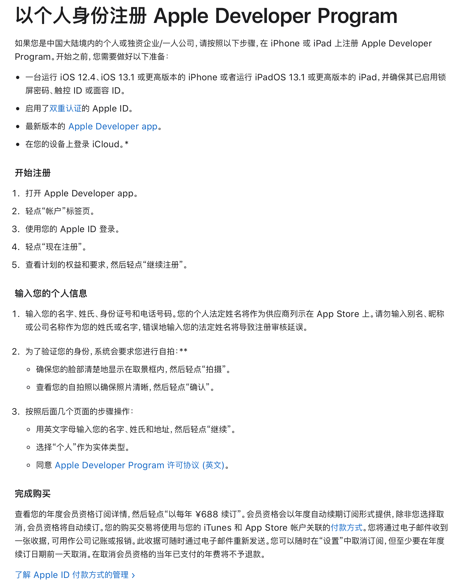

## 目前对各网站的支持情况

| Site          | Supported |
| :------------ | --------: |
| baidu         |       Yes |
| gitee         |       Yes |
| csdn          |       Yes |
| bing          |       Yes |
| google        |       Yes |
| github        |       Yes |
| stackoverflow |       Yes |
| apple         |        No |

## 开发过程

> [官网视频教程](https://devstreaming-cdn.apple.com/videos/wwdc/2020/10665/3/C174BFAC-4EEB-41C6-9019-4386F9E18CD5/master.m3u8)

1. 看完教程之后，我先创建了一份 cn_zh 的本地化文件，成功改掉了默认的插件名称。
2. 接着设计总体架构：
   - background.js 维护当前是否需要反转颜色（没错，我只是在反转颜色），因为 swift 经验比较少，又是给自己用，就没有纠结给 native 通信。
   - content.js 首先与 background.js 通信，在启用反转的情况下，立刻反转页面颜色。具体的反转方法后面细说。
   - popup.js 第一步也是与 background.js 通信，获取启用状态并以合适的 UI 显示出来；同时，通过一个按钮来切换启用状态，并通过 background.js 间接地调用 content.js 里反转的逻辑。
3. 最终设计反转算法。经历了多次迭代，以及将单文件代码拆分模块，最终设计了两级反转算法（在默认级别失效后，启动降级操作）：
   - 默认级别是通过 `document.styleSheets` 更改 `CSSStyleDeclaration` 当中的颜色部分（注：由于 `CSS3` 变量的存在，所以这里的更改是针对属性值的）。
   - 降级后，深度优先后序遍历页面所有节点，通过计算 `getComputedStyle` 获取 `CSSStyleDeclaration`，将 `color`, `background-color` 反转后，写入元素内联 `style` 属性（注：没错，既然是降级，边框和渐变色就顾不上了，而且伪元素本来也遍历不到）。
   - 降级的条件：首先遇到不合法的 `CSSStyleSheet` 时，会根据 `href` 用跨域方式重试。如果此方法依然不行，就采取降级方式。

## 发布过程

> 因为穷，玩不起。既没有苹果手机，也交不起会费。

只好在最后献上[开源链接](https://gitee.com/yx1991/dark-mode-web-extension)，希望有人能一起研究、改进。
