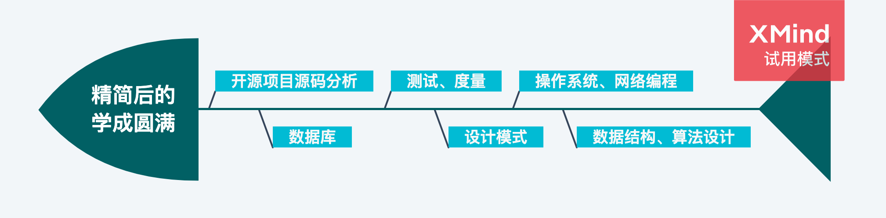
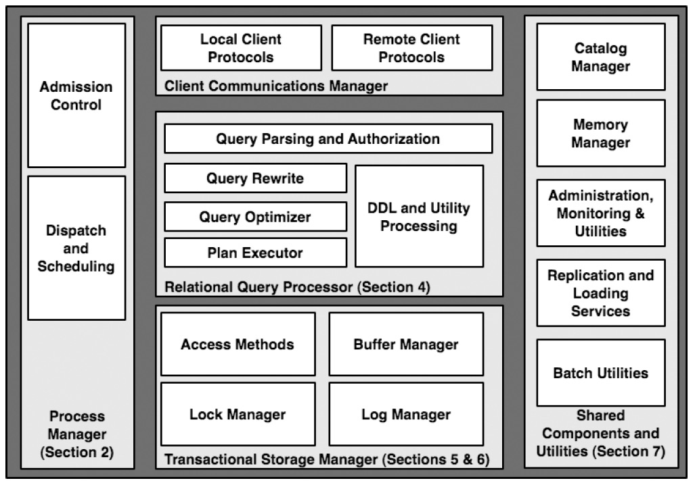

## 0. 学习大纲

---

[【项目/编程语言/当前版本】一览表](post:hidden-resume)

### 35+ 个主题

- [大学基础课程（5+）](scroll-to:1.-大学基础课程（5+）)
- [大学专业课程（15+）](scroll-to:2.-大学专业课程（15+）)
- [程序设计语言（10+）](scroll-to:3.-程序设计语言（10+）)
- [软件开发框架/工具（5+）](scroll-to:4.-软件开发框架/工具（5+）)
- [开源项目剖析（N+）](scroll-to:5.-开源项目剖析)

## 1. 大学基础课程（5+）

_仅列出数学相关，另外还有英语_

### 1. 高等数学

- [回到大目录](scroll-to:35+-个主题)

### 2. 离散数学

- [回到大目录](scroll-to:35+-个主题)

### 3. 概率论

- [回到大目录](scroll-to:35+-个主题)

### 4. 数理统计

- [回到大目录](scroll-to:35+-个主题)

### 5. 线性代数

- [回到大目录](scroll-to:35+-个主题)

## 2. 大学专业课程（15+）

_非程序设计语言类_

### 0. 软件工程

- [回到大目录](scroll-to:35+-个主题)

### 1. 数据结构

- [回到大目录](scroll-to:35+-个主题)

### 2. 算法分析与设计

- [读书笔记之《Algorithms》](post:Book-Algorithms-13-Summary)
- [回到大目录](scroll-to:35+-个主题)

### 3. 用户界面设计与评价

- [回到大目录](scroll-to:35+-个主题)

### 4. 操作系统原理

- [回到大目录](scroll-to:35+-个主题)

### 5. 计算机网络原理

- [回到大目录](scroll-to:35+-个主题)

### 6. 计算机图形学

- [回到大目录](scroll-to:35+-个主题)

### 7. 编译原理

- [回到大目录](scroll-to:35+-个主题)

### 8. 软件体系结构

- [回到大目录](scroll-to:35+-个主题)

### 9. 软件测试技术

- [回到大目录](scroll-to:35+-个主题)

### 10. 软件开发架构平台技术

- [回到大目录](scroll-to:35+-个主题)

### 11. 软件项目组织与管理

- [回到大目录](scroll-to:35+-个主题)

### 12. 电子商务应用

- [回到大目录](scroll-to:35+-个主题)

### 13. 软件度量及应用

- [回到大目录](scroll-to:35+-个主题)

### 14. 软件外包概论

- [回到大目录](scroll-to:35+-个主题)

### 15. CMM 与 ISO9000

- [回到大目录](scroll-to:35+-个主题)

## 3. 程序设计语言（10+）

_包括大学教的和自学_

### 0. C/C++语言程序设计

- [回到大目录](scroll-to:35+-个主题)

### 1. 汇编语言程序设计

- [回到大目录](scroll-to:35+-个主题)

### 2. 数据库系统（初级/高级）

任何好的多用户系统都有准入控制机制，在系统没有充足资源的情况下，**新的任务不被接受**。如果拥有一个良好的准入控制器，系统将在过载情况下发生比较优雅的性能衰退：事务延迟随着到达率的增加而适当增加，但吞吐量一直保持在峰值。

- 事务延迟： 延迟一般包括单向延迟（One-way Latency）和往返延迟（Round Trip Latency），实际测量时一般取往返延迟。它的单位一般是 ms、s、min、h 等。
- 吞吐量：一般指相当一段时间内测量出来的系统单位时间处理的任务数或事务数（TPS）。注意“相当一段时间”，不是几秒，而可能是十几分钟、半个小时、一天、几周甚至几月。它的单位一般是 TPS、每单位时间写入磁盘的字节数等。

- [回到大目录](scroll-to:35+-个主题)

### 3. Linux 程序设计环境

- [回到大目录](scroll-to:35+-个主题)

### 4. Java 语言程序设计

- [回到大目录](scroll-to:35+-个主题)

### 5. JavaScript 语言程序设计

- [回到大目录](scroll-to:35+-个主题)

### 6. TypeScript 语言程序设计

- [回到大目录](scroll-to:35+-个主题)

### 7. Python 语言程序设计

- [回到大目录](scroll-to:35+-个主题)

### 8. Go 语言程序设计

- [回到大目录](scroll-to:35+-个主题)

### 9. C# 语言程序设计

逻辑计算分短路的和非短路的，emm……intresting。

- [回到大目录](scroll-to:35+-个主题)

## 4. 软件开发框架/工具（5+）

_包括实战过的和按兴趣学的_

### 1. Spring / SpringBoot / SpringCloud

- [回到大目录](scroll-to:35+-个主题)

### 2. ReactJS

- [回到大目录](scroll-to:35+-个主题)

### 3. ReactVR / ThreeJS

- [回到大目录](scroll-to:35+-个主题)

### 4. Webpack

- [回到大目录](scroll-to:35+-个主题)

### 5. CKEditor

- [回到大目录](scroll-to:35+-个主题)

## 5. 开源项目剖析

_站内传送门列表_

- [回到大目录](scroll-to:35+-个主题)
