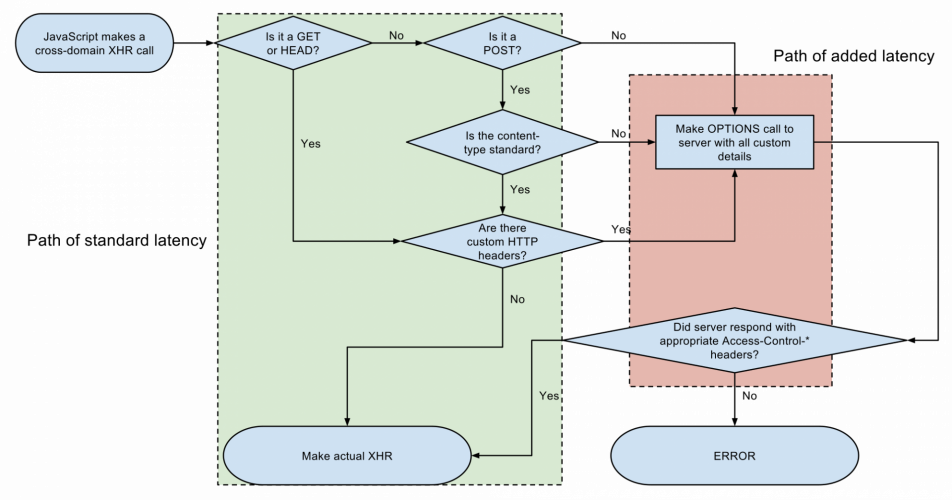

1. Lazily render below-the-fold content
2. Use lazy data fetching
3. Cache the static content
4. Use WebSockets where appropriate (i.e. for highly interactive apps)
5. Employ JSONP/CORS to bypass the same-origin policyAs preflight checks add a second roundtrip, they can effectively double your latency.

   1. Write your APIs and serve your content using only HEAD, GET, POST, Accept, Accept-Language, Content-Language, and Content-Type as they don’t initiate preflight requests.
   2. Cache the preflight responses to decrease the subsequent checks.

6. Use a content delivery network (CDN)
