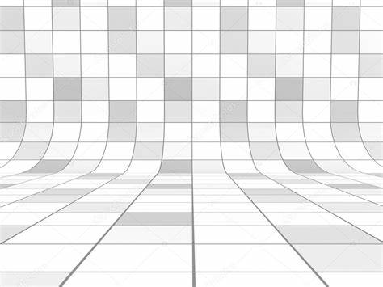

这是一篇测试

> Markdown CSS. A collection of stylesheets to make generated markdown, or raw HTML, look beautiful. Splendor. Features full bleed images and a dramatic type scale. Retro. A blast to the past. Air. A centered layout with circular images.

